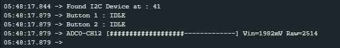
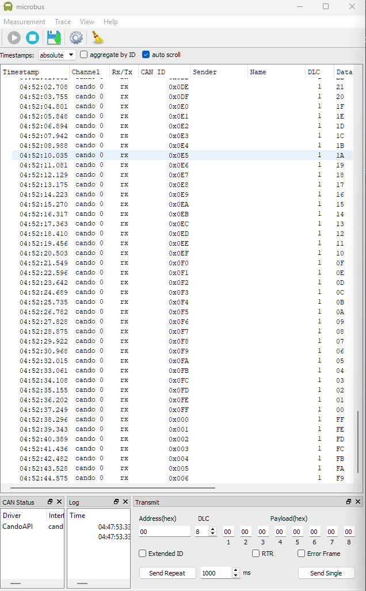

# SmartWheels EV2 Initialization Code

## Peripherals covered:  
   1. I2C  
      Scans available devices from 0x0 to 0x7f
   2. CAN2.0 Standard - 250kbps  
      Transmits frames with ID 0x0 to 0xff and data from 0xff to 0x0
   3. Digital Input - 2 User buttons
   4. Digital Output - RGB LED
   5. Analog Input - Potentiometer
   6. UART - Sending Data  
      Prints ADC, Button Input, and I2C scan Data

## Requirements  
   1. NXP S32 Design Studio Version 3.5
   2. S32K1xx SDK RTM v4.0.1 (inside S32DS3.5)

## Screenshots  

1. I2C Scan  
   Button States  
   ADC Input Graph   

     

2. CAN Data Transmission
  
     
  
